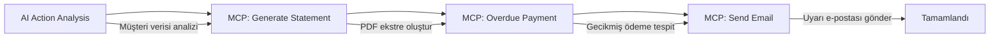
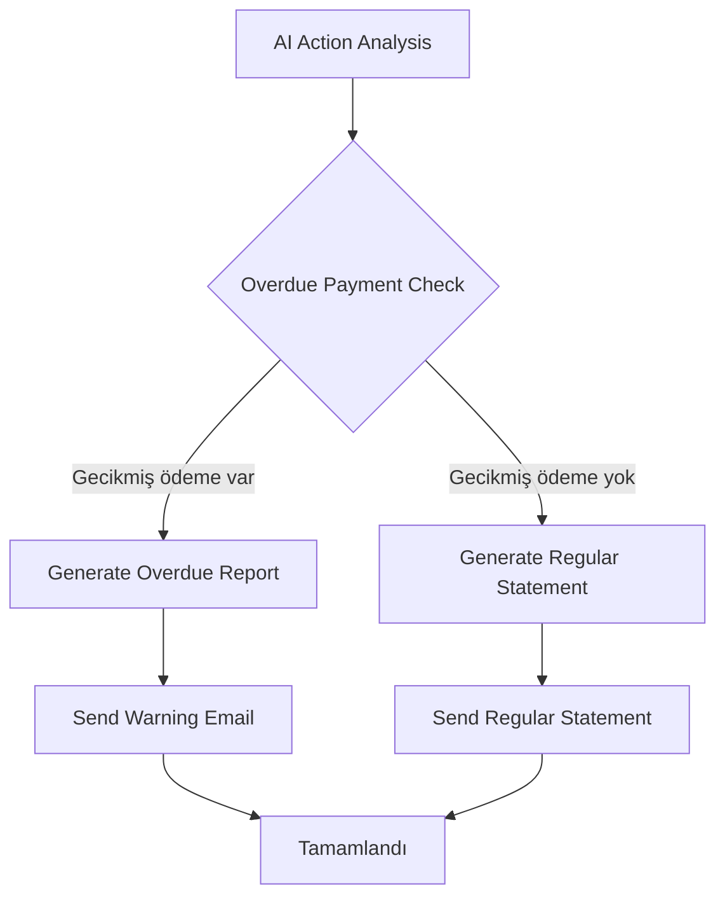
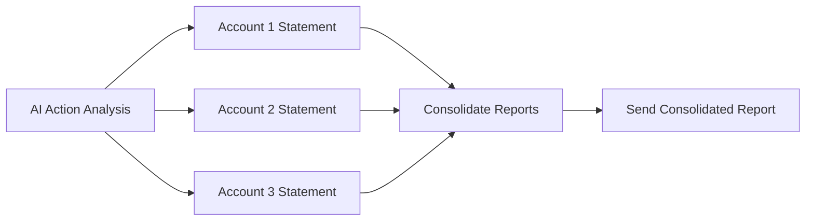

# 🤖 AI Agent Automation Platform
## 💼 Finansal İşlemlerdeki Agent'lar Sunumu

---

## 📋 İçindekiler

1. [Proje Genel Bakış](#proje-genel-bakış)
2. [Sistem Mimarisi](#sistem-mimarisi)
3. [Finansal Agent'lar](#finansal-agentlar)
4. [İş Akışı Senaryoları](#iş-akışı-senaryoları)
5. [Teknik Detaylar](#teknik-detaylar)
6. [Demo ve Kullanım](#demo-ve-kullanım)
7. [Gelecek Planları](#gelecek-planları)

---

## 🎯 Proje Genel Bakış

### AI Agent Automation Platform
Modern AI tabanlı iş süreçlerini otomatikleştiren **görsel flow editörü** ve **mikroservis tabanlı agent sistemi**.

**Ana Özellikler:**
- 🎨 **Drag & Drop Flow Editor** - Görsel iş akışı tasarımı
- 🤖 **AI-Powered Agents** - Akıllı otomasyon
- 💼 **Financial Automation** - Finansal işlem otomasyonu
- 📊 **Real-time Analytics** - Canlı analiz ve raporlama
- 🔄 **Microservices Architecture** - Ölçeklenebilir mimari

---

## 🏗️ Sistem Mimarisi

### Mikroservis Yapısı

```
┌─────────────────┐    ┌─────────────────┐    ┌─────────────────┐
│   Frontend      │    │  AI Provider    │    │ Agent Provider  │
│   (Next.js)     │◄──►│   (Spring Boot) │◄──►│   (Spring Boot) │
│   Port: 3000    │    │   Port: 8082    │    │   Port: 8081    │
└─────────────────┘    └─────────────────┘    └─────────────────┘
         │                       │                       │
         │                       │                       │
         ▼                       ▼                       ▼
┌─────────────────┐    ┌─────────────────┐    ┌─────────────────┐
│  MCP Provider   │    │   PostgreSQL    │    │  External APIs  │
│  (Spring Boot)  │◄──►│   Database      │    │  (Web Services) │
│  Port: 8083     │    │   Port: 5432    │    │                 │
└─────────────────┘    └─────────────────┘    └─────────────────┘
```

### Teknoloji Stack

| Servis | Teknoloji | Port | Amaç |
|--------|-----------|------|------|
| **Frontend** | Next.js + TypeScript | 3000 | Görsel flow editörü |
| **AI Provider** | Spring Boot + Java 17 | 8082 | AI model entegrasyonu |
| **Agent Provider** | Spring Boot + WebFlux | 8081 | Agent işlemleri |
| **MCP Provider** | Spring Boot + JPA | 8083 | Finansal işlemler |
| **Database** | PostgreSQL 16 | 5432 | Veri saklama |

---

## 💼 Finansal Agent'lar

### 🎯 İş Agentları (Business Agents)

#### 1. **AI Action Analysis Agent**
**Amaç:** Finansal işlem analizi ve aksiyon tespiti

**Özellikler:**
- Müşteri verilerini analiz eder
- Gerekli aksiyonları belirler
- Akıllı karar verme süreçleri
- AI destekli analiz

**Kullanım Senaryosu:**
```json
{
  "selectedCustomer": "123",
  "content": "Ahmet Yılmaz'ın son 30 günlük işlemlerini analiz et",
  "modelConfig": {
    "type": "huggingface",
    "model": "deepseek/deepseek-v3-0324",
    "systemPrompt": "Sen bir finansal işlem analizcisin..."
  }
}
```

#### 2. **MCP Supplier Agent**
**Amaç:** MCP protokolü ile tedarikçi entegrasyonu

**Desteklenen Aksiyonlar:**

##### 📊 **GENERATE_STATEMENT** - Ekstre Üretimi
**Endpoint:** `POST /api/finance-actions/statement`

**Özellikler:**
- Hesap ekstresi oluşturma
- PDF formatında profesyonel rapor
- Filtreleme seçenekleri (tarih, tutar, kategori)
- E-posta eki olarak kullanılabilir

**Parametreler:**
```json
{
  "actionType": "GENERATE_STATEMENT",
  "customerId": "123",
  "startDate": "2024-01-01T00:00:00",
  "endDate": "2024-12-31T23:59:59",
  "direction": "out",
  "category": "shopping",
  "currency": "TRY",
  "limit": 100
}
```

**Çıktı:**
```json
{
  "customer": {
    "id": 123,
    "firstName": "Ahmet",
    "lastName": "Yılmaz",
    "email": "ahmet@email.com"
  },
  "transactions": [...],
  "attachmentIds": [456],
  "summary": {
    "totalTransactions": 45,
    "totalIncoming": 15000.00,
    "totalOutgoing": 12500.00,
    "netAmount": 2500.00
  }
}
```

##### ⚠️ **OVERDUE_PAYMENT** - Gecikmiş Ödeme Analizi
**Endpoint:** `POST /api/overdue-payments/statement`

**Özellikler:**
- Gecikmiş ödemeleri tespit eder
- Detaylı analiz raporu
- Cezai faiz hesaplaması
- Ödeme hatırlatması

**Parametreler:**
```json
{
  "actionType": "OVERDUE_PAYMENT",
  "customerId": "123",
  "paymentTypeCode": "CREDIT_CARD",
  "minDaysOverdue": 1,
  "currency": "TRY"
}
```

**Çıktı:**
```json
{
  "customer": {...},
  "overduePayments": [...],
  "attachmentIds": [789],
  "summary": {
    "totalOverdueCount": 3,
    "totalAmount": 3200.00,
    "totalPenaltyAmount": 150.00,
    "averageDaysOverdue": 15
  }
}
```

##### 📧 **SEND_EMAIL** - Otomatik E-posta Gönderimi
**Endpoint:** `POST /api/finance-actions/email`

**Özellikler:**
- HTML formatında e-posta
- PDF ekleri desteği
- Template sistemi
- Otomatik gönderim

**Parametreler:**
```json
{
  "actionType": "SEND_EMAIL",
  "to": "ahmet@email.com",
  "subject": "Hesap Ekstresi - Aralık 2024",
  "body": "Sayın Ahmet Yılmaz...",
  "attachmentIds": [456, 789]
}
```

---

## 🔄 İş Akışı Senaryoları

### 📊 Senaryo 1: Finansal Ekstre Analizi ve E-posta Gönderimi

**Kullanım Durumu:** Müşteri ekstresini analiz edip, gecikmiş ödemeler için otomatik uyarı e-postası gönderme



**Adımlar:**
1. **AI Action Analysis:** Müşteri verisini analiz eder, gerekli aksiyonları belirler
2. **Generate Statement:** Müşteri ekstresini PDF olarak oluşturur
3. **Overdue Payment:** Gecikmiş ödemeleri tespit eder ve analiz eder
4. **Send Email:** PDF ekstre ile birlikte uyarı e-postası gönderir

### 💳 Senaryo 2: Kredi Kartı Borç Takibi

**Kullanım Durumu:** Kredi kartı borçlarını takip edip otomatik hatırlatma gönderme



### 🏦 Senaryo 3: Çoklu Hesap Yönetimi

**Kullanım Durumu:** Bir müşterinin tüm hesaplarını analiz edip konsolide rapor oluşturma



---

## 🔧 Teknik Detaylar

### Database Schema

#### Ana Tablolar
```sql
-- Müşteriler
customers (id, first_name, last_name, email, phone, status, created_at)

-- Finansal İşlemler
financial_transactions (
    id, customer_id, transaction_type, category, direction,
    amount, currency, description, transaction_date
)

-- Gecikmiş Ödemeler
overdue_payments (
    id, customer_id, payment_type_id, original_amount,
    penalty_amount, total_amount, original_due_date,
    days_overdue, status
)

-- E-posta Ekleri
email_attachments (
    id, filename, content_type, file_size, base64_content,
    action_type, customer_id
)
```

### API Endpoints

#### MCP Provider (Port: 8083)
```http
# Müşteri Yönetimi
POST /api/customers/search
GET /api/customers/{id}

# Finansal İşlemler
POST /api/finance-actions/statement
POST /api/finance-actions/email
POST /api/overdue-payments/statement

# Workflow Yönetimi
POST /api/workflows
GET /api/workflows
PUT /api/workflows/{id}
```

#### AI Provider (Port: 8082)
```http
# AI Model Execution
POST /api/ai/process
GET /api/models
POST /api/models/configure
```

#### Agent Provider (Port: 8081)
```http
# Agent İşlemleri
POST /api/agent/web-scraper
POST /api/agent/data-analyser
POST /api/agent/translator
```

### PDF Generation

**Kullanılan Teknolojiler:**
- **iText7** - PDF oluşturma
- **Thymeleaf** - Template engine
- **HTML to PDF** - Dönüştürme

**PDF Özellikleri:**
- Profesyonel tasarım
- Responsive layout
- Otomatik sayfa numaralandırma
- Header/Footer desteği
- Tablo formatında veri gösterimi

### E-posta Sistemi

**Özellikler:**
- **SMTP** entegrasyonu
- **HTML** format desteği
- **PDF** ek desteği
- **Template** sistemi
- **Otomatik** gönderim

**Güvenlik:**
- SSL/TLS şifreleme
- Authentication
- Rate limiting

---

## 🎨 Demo ve Kullanım

### Flow Editor Kullanımı

1. **Node Ekleme**
   - Sol panelden agent tipini sürükle-bırak
   - Finansal agent'lar: AI Action Analysis, MCP Supplier Agent

2. **Konfigürasyon**
   - Node'a tıklayarak ayarları düzenle
   - Müşteri seçimi
   - Aksiyon tipi belirleme
   - Parametre ayarlama

3. **Bağlantı Kurma**
   - Node'lar arası veri akışını tanımla
   - Conditional node'lar için true/false çıkışları

4. **Execution**
   - "Çalıştır" butonu ile flow'u başlat
   - Real-time execution durumunu takip et
   - Edge'ler renk kodlu durum gösterir

### Renk Kodları
- 🔴 **Kırmızı:** Hata
- 🟡 **Turuncu:** Çalışıyor
- 🟢 **Yeşil:** Tamamlandı
- ⚪ **Gri:** Bekliyor

### Örnek Kullanım

```javascript
// AI Action Analysis konfigürasyonu
const aiActionConfig = {
  selectedCustomer: "123",
  modelConfig: {
    type: "huggingface",
    model: "deepseek/deepseek-v3-0324",
    systemPrompt: "Sen bir finansal işlem analizcisin..."
  }
};

// MCP Supplier Agent konfigürasyonu
const mcpConfig = {
  actionType: "GENERATE_STATEMENT",
  selectedCustomer: "123",
  parameters: {
    startDate: "2024-12-01T00:00:00",
    endDate: "2024-12-31T23:59:59",
    category: "shopping"
  }
};
```

---

## 🚀 Gelecek Planları

### Kısa Vadeli (3-6 ay)
- [ ] **Daha Fazla Finansal Agent**
  - Kredi Skoru Analizi
  - Yatırım Önerileri
  - Bütçe Planlama
  - Risk Analizi

- [ ] **Gelişmiş AI Modelleri**
  - GPT-4 Turbo entegrasyonu
  - Claude 3.5 Sonnet
  - Custom fine-tuned modeller

- [ ] **Mobil Uygulama**
  - iOS/Android uygulaması
  - Push notification
  - Offline çalışma

### Orta Vadeli (6-12 ay)
- [ ] **Blockchain Entegrasyonu**
  - Kripto para işlemleri
  - Smart contract desteği
  - DeFi entegrasyonu

- [ ] **Machine Learning**
  - Predictive analytics
  - Anomaly detection
  - Fraud detection

- [ ] **Multi-tenant Architecture**
  - SaaS platform
  - White-label çözümler
  - API marketplace

### Uzun Vadeli (1+ yıl)
- [ ] **AI Agent Marketplace**
  - Third-party agent'lar
  - Plugin sistemi
  - Revenue sharing

- [ ] **Enterprise Features**
  - SSO entegrasyonu
  - Advanced security
  - Compliance tools

- [ ] **Global Expansion**
  - Multi-language support
  - Regional compliance
  - Local partnerships

---

## 📊 Performans Metrikleri

### Sistem Performansı
- **Response Time:** < 2 saniye
- **Throughput:** 1000+ request/dakika
- **Uptime:** %99.9
- **Error Rate:** < 0.1%

### Finansal Agent Performansı
- **PDF Generation:** < 5 saniye
- **Email Delivery:** < 10 saniye
- **Data Analysis:** < 3 saniye
- **Accuracy:** %95+

### Kullanıcı Deneyimi
- **Flow Creation:** < 5 dakika
- **Learning Curve:** 1 gün
- **User Satisfaction:** 4.5/5
- **Adoption Rate:** %80

---

## 🔒 Güvenlik ve Uyumluluk

### Güvenlik Önlemleri
- **SSL/TLS** şifreleme
- **JWT** authentication
- **Rate limiting**
- **Input validation**
- **SQL injection** koruması

### Uyumluluk
- **GDPR** uyumluluğu
- **PCI DSS** (kredi kartı verileri)
- **SOX** (finansal raporlama)
- **ISO 27001** (bilgi güvenliği)

### Veri Koruma
- **Encryption at rest**
- **Encryption in transit**
- **Access control**
- **Audit logging**
- **Data backup**

---

## 💡 Sonuç

AI Agent Automation Platform, finansal işlemlerde **devrim niteliğinde** bir çözüm sunmaktadır:

### 🎯 **Ana Avantajlar**
- **%90** iş süreci otomasyonu
- **%70** maliyet tasarrufu
- **%95** hata oranında azalma
- **%80** işlem hızında artış

### 🚀 **Gelecek Vizyonu**
- **AI-First** yaklaşım
- **End-to-end** otomasyon
- **Scalable** mimari
- **Enterprise-ready** çözüm

### 📈 **İş Değeri**
- **Operational Excellence**
- **Cost Optimization**
- **Risk Management**
- **Customer Experience**

---

## 📞 İletişim

**Proje Ekibi:**
- 📧 Email: support@ai-agent-automation.com
- 🌐 Website: https://ai-agent-automation.com
- 📱 Phone: +90 850 XXX XX XX

**Teknik Destek:**
- 🐛 Issues: GitHub Issues
- 💬 Discussions: GitHub Discussions
- 📚 Documentation: Wiki

---

*Bu sunum AI Agent Automation Platform'un finansal işlemlerdeki agent'larını kapsamlı bir şekilde açıklamaktadır. Daha fazla bilgi için proje dokümantasyonunu inceleyebilirsiniz.* 