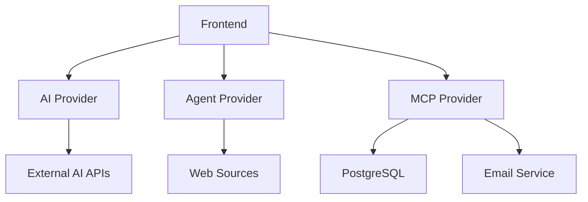

# AI Agent Automation Platform

[](https://opensource.org/licenses/MIT)
[](https://openjdk.java.net/projects/jdk/17/)
[](https://spring.io/projects/spring-boot)
[](https://nextjs.org/)
[](https://www.typescriptlang.org/)

Modern AI tabanlı iş süreçlerini otomatikleştiren **görsel flow editörü** ve **mikroservis tabanlı agent sistemi**. 

Drag & drop arayüzü ile karmaşık AI iş akışları oluşturun, finansal analiz yapın, otomatik raporlama ve e-posta gönderimi gerçekleştirin.


*AI Agent Flow Editor - Görsel İş Akışı Tasarım Arayüzü*

## 📋 İçindekiler

- [🏗️ Sistem Mimarisi](#️-sistem-mimarisi)
- [🚀 Özellikler](#-özellikler)
- [🏢 Mikroservis Detayları](#-mikroservis-detayları)
- [🔄 Flow Execution Mantığı](#-flow-execution-mantığı)
- [📊 Örnek Senaryo](#-örnek-senaryo)
- [🛠️ Kurulum ve Çalıştırma](#️-kurulum-ve-çalıştırma)
- [🎨 Kullanım](#-kullanım)
- [🔧 API Endpoints](#-api-endpoints)
- [🧪 Test](#-test)
- [📈 Monitoring](#-monitoring)

## 🚀 Quick Start

```bash
# 1. Repository'yi klonlayın
git clone https://github.com/[your-username]/ai-agent-automation.git
cd ai-agent-automation

# 2. Backend servisleri başlatın
mvn clean install
cd mcp-provider && mvn spring-boot:run &
cd ../agent-provider && mvn spring-boot:run &
cd ../ai-provider && mvn spring-boot:run &

# 3. Frontend'i başlatın
cd frontend
npm install && npm run dev

# 4. Tarayıcıda açın: http://localhost:3000
```

## 🏗️ Sistem Mimarisi

Bu proje, **mikroservis mimarisi** ile tasarlanmış kapsamlı bir AI agent automation platformudur:

### 📊 Mikroservis Yapısı

```
AI Agent Automation Platform
├── 🎨 Frontend (Next.js)          → Port: 3000
├── 🤖 AI Provider                 → Port: 8082
├── 🔧 Agent Provider              → Port: 8081  
└── 💼 MCP Provider                → Port: 8083
```

## 🚀 Özellikler

### 🎯 İş Agentları (Business Agents)
- **AI Action Analysis**: Finansal işlem analizi ve aksiyon tespiti
- **MCP Supplier Agent**: MCP protokolü ile tedarikçi entegrasyonu
  - GENERATE_STATEMENT: Ekstre üretimi
  - OVERDUE_PAYMENT: Gecikmiş ödeme kontrolü
  - SEND_EMAIL: Otomatik e-posta gönderimi

### 🔧 Genel Agentlar (General Agents)
- **Web Scraper**: Web sitelerinden veri çekme
- **Web Searcher**: İnternet araması ve analizi
- **Code Interpreter**: Kod çalıştırma ve analizi
- **Data Analyst**: Veri analizi ve görselleştirme
- **Image Generator**: AI ile görsel üretimi
- **Text Generator**: Metin üretimi ve düzenleme
- **Translator**: Çok dilli çeviri
- **YouTube Summarizer**: Video özetleme
- **Research Agent**: Araştırma ve rapor hazırlama

### 🎛️ Kontrol Yapıları
- **Conditional Node**: Koşullu dallanma
- **Result Node**: Sonuç görüntüleme

## 🏢 Mikroservis Detayları

### 🎨 Frontend (Next.js + TypeScript)
**Port**: 3000 | **Framework**: Next.js 15.3.2 | **Language**: TypeScript 5.8.3

```
frontend/
├── src/
│   ├── components/
│   │   ├── flow/
│   │   │   ├── FlowEditor.tsx      # Ana flow editörü
│   │   │   ├── AIAgentNode.tsx     # Agent node bileşeni
│   │   │   ├── ConditionalNode.tsx # Koşullu node
│   │   │   └── ResultNode.tsx      # Sonuç node
│   │   ├── ui/                     # Shadcn/ui bileşenleri
│   │   └── customer/               # Müşteri yönetimi
│   ├── store/
│   │   ├── slices/
│   │   │   ├── flowSlice.ts        # Flow state yönetimi
│   │   │   └── customerSlice.ts    # Müşteri state yönetimi
│   │   └── types.ts                # TypeScript tipleri
│   └── api/
│       ├── agents.ts               # Agent API çağrıları
│       └── customer.ts             # Müşteri API'leri
├── package.json                    # Dependencies
└── tailwind.config.ts              # Styling
```

**Temel Teknolojiler:**
- **React Flow**: Görsel node editörü
- **Redux Toolkit**: State yönetimi
- **Tailwind CSS**: Styling
- **Radix UI**: UI bileşenleri
- **Axios**: HTTP client

### 🤖 AI Provider (Spring Boot)
**Port**: 8082 | **Framework**: Spring Boot 3.2.5 | **Language**: Java 17

```
ai-provider/
├── src/main/java/com/example/aiprovider/
│   ├── controller/          # REST Controllers
│   ├── service/            # Business Logic
│   ├── model/              # Data Models
│   ├── client/             # External API Clients
│   ├── utils/              # Utility Classes
│   └── exception/          # Exception Handling
├── pom.xml                 # Maven Dependencies
└── application.properties  # Configuration
```

**Temel Teknolojiler:**
- **Spring Boot Web**: REST API
- **Spring Cloud OpenFeign**: Mikroservis iletişimi
- **Jackson**: JSON processing
- **Lombok**: Code generation

**Sorumluluklar:**
- AI model entegrasyonları
- Dış AI servis çağrıları
- Model response işleme

### 🔧 Agent Provider (Spring Boot)
**Port**: 8081 | **Framework**: Spring Boot 3.2.5 | **Language**: Java 17

```
agent-provider/
├── src/main/java/com/example/agentprovider/
│   ├── controller/          # REST Controllers
│   ├── service/            # Agent Services
│   ├── model/              # Agent Models
│   ├── client/             # HTTP Clients
│   └── config/             # Configuration
├── pom.xml                 # Maven Dependencies
└── application.properties  # Configuration
```

**Temel Teknolojiler:**
- **Spring Boot WebFlux**: Reactive programming
- **JSoup**: HTML parsing (Web Scraper)
- **Apache POI**: Excel/Word processing
- **JFreeChart**: Chart generation
- **Apache Commons**: Utility libraries

**Sorumluluklar:**
- Web scraping işlemleri
- Veri analizi ve görselleştirme
- Dosya işleme (Excel, CSV, PDF)
- Code interpretation

### 💼 MCP Provider (Spring Boot)
**Port**: 8083 | **Framework**: Spring Boot 3.2.5 | **Language**: Java 17

```
mcp-provider/
├── src/main/java/com/example/mcpprovider/
│   ├── controller/          # REST Controllers
│   ├── service/            # Business Services
│   ├── entity/             # JPA Entities
│   ├── repository/         # Data Repositories
│   ├── dto/                # Data Transfer Objects
│   ├── mapper/             # Object Mappers
│   ├── config/             # Configuration
│   ├── client/             # External Clients
│   └── enums/              # Enumerations
├── pom.xml                 # Maven Dependencies
└── application.properties  # Configuration
```

**Temel Teknolojiler:**
- **Spring Boot Data JPA**: Database operations
- **PostgreSQL**: Primary database
- **Spring Boot Mail**: Email sending
- **Thymeleaf**: Template engine
- **iText**: PDF generation
- **Flyway**: Database migrations

**Sorumluluklar:**
- MCP protokolü implementasyonu
- Müşteri yönetimi
- Finansal işlem analizi
- E-posta ve PDF servisleri
- Veritabanı operasyonları

## 🔄 Flow Execution Mantığı

### 1. Topological Sorting
Node'lar dependency sırasına göre otomatik sıralanır:
```
AI Action Analysis → GENERATE_STATEMENT → OVERDUE_PAYMENT → SEND_EMAIL
```

### 2. Sequential Execution
Her node sırasıyla çalıştırılır ve bir sonrakine geçmeden tamamlanması beklenir.

### 3. Data Flow
- Önceki node'ların çıktıları sonraki node'lara input olarak geçer
- Accumulated responses Redux store'da tutulur
- SEND_EMAIL node tüm önceki attachmentIds'leri birleştirir

### 4. Mikroservis İletişimi


## 📊 Örnek Senaryo

### Finansal İşlem Analizi ve E-posta Gönderimi

1. **AI Action Analysis** (MCP Provider)
   - Müşteri seçimi ve finansal analiz
   - Gerekli aksiyonları tespit eder
   - Output: `financeActionTypes: ['GENERATE_STATEMENT', 'OVERDUE_PAYMENT', 'SEND_EMAIL']`

2. **GENERATE_STATEMENT** (MCP Provider)
   - Ekstre üretimi gerekli mi kontrolü
   - API: `POST /mcp-provider/api/mcp-request`
   - Output: `attachmentIds: [58]`

3. **OVERDUE_PAYMENT** (MCP Provider)
   - Gecikmiş ödeme kontrolü
   - API: `POST /mcp-provider/api/mcp-request`
   - Output: `attachmentIds: [59]`

4. **SEND_EMAIL** (MCP Provider)
   - Önceki tüm attachmentIds'leri birleştirir: `[58, 59]`
   - Müşteriye e-posta gönderir
   - API: `POST /mcp-provider/api/mcp-request`

## 🛠️ Kurulum ve Çalıştırma

### Gereksinimler
- **Java 17+**
- **Node.js 18+**
- **Maven 3.8+**
- **PostgreSQL 13+**
- **npm veya yarn**

### 1. Backend Mikroservisleri

#### Parent Project Build
```bash
# Tüm mikroservisleri build et
mvn clean install
```

#### AI Provider (Port: 8082)
```bash
cd ai-provider
mvn spring-boot:run
```

#### Agent Provider (Port: 8081)
```bash
cd agent-provider
mvn spring-boot:run
```

#### MCP Provider (Port: 8083)
```bash
cd mcp-provider

# PostgreSQL veritabanı oluştur
createdb mcp_db

# Veritabanı migrasyonları
mvn flyway:migrate

# Servisi başlat
mvn spring-boot:run
```

### 2. Frontend Kurulumu
```bash
cd frontend
npm install
npm run dev
```

### Environment Variables

#### Backend (.env veya application.properties)
```properties
# Database
spring.datasource.url=jdbc:postgresql://localhost:5432/mcp_db
spring.datasource.username=postgres
spring.datasource.password=postgres

# Email
spring.mail.host=smtp.gmail.com
spring.mail.username=your-email@gmail.com
spring.mail.password=your-app-password

# External APIs
RAPIDAPI_YOUTUBE_TRANSCRIPTOR_KEY=your_rapidapi_key
DEEPL_API_AUTH_KEY=your_deepl_api_key
```

#### Frontend (.env.local)
```env
NEXT_PUBLIC_API_URL=http://localhost:8083/mcp-provider
NEXT_PUBLIC_AI_PROVIDER_URL=http://localhost:8082
NEXT_PUBLIC_AGENT_PROVIDER_URL=http://localhost:8081
```

## 🎨 Kullanım

### 1. Node Ekleme
- Sol panelden istenen agent tipini sürükle-bırak
- **İş Agentları**: Müşteri odaklı operasyonlar
- **Genel Agentlar**: Genel amaçlı işlemler

### 2. Node Konfigürasyonu
- Her node'a tıklayarak ayarları düzenleyin
- Model konfigürasyonu (GPT, Claude, Hugging Face)
- Özel parametreler ve system prompt'lar

### 3. Bağlantı Kurma
- Node'lar arası veri akışını tanımlayın
- Conditional node'lar için true/false çıkışları

### 4. Execution
- **"Çalıştır"** butonu ile flow'u başlatın
- Real-time execution durumunu takip edin
- Edge'ler renk kodlu durum gösterir:
  - 🔴 **Kırmızı**: Hata
  - 🟡 **Turuncu**: Çalışıyor
  - 🟢 **Yeşil**: Tamamlandı
  - ⚪ **Gri**: Bekliyor

## 🔧 API Endpoints

### MCP Provider (Port: 8083)

#### Customer Management
```http
POST /mcp-provider/api/customers/search
Content-Type: application/json

{
  "query": "customer name or id"
}
```

#### Action Analysis
```http
POST /mcp-provider/action-analysis
Content-Type: application/json

{
  "content": "analysis prompt",
  "model": "huggingface/deepseek/deepseek-v3-0324",
  "customerNo": "12345"
}
```

#### MCP Operations
```http
POST /mcp-provider/api/mcp-request
Content-Type: application/json

{
  "selectedActions": ["SEND_EMAIL"],
  "parameters": {
    "SEND_EMAIL": {
      "customerId": "12345",
      "to": "customer@example.com",
      "subject": "Finansal Rapor",
      "body": "Rapor ektedir",
      "attachmentIds": [58, 59]
    }
  }
}
```

### Agent Provider (Port: 8081)

#### Web Scraper
```http
POST /agents/web-scraper
Content-Type: application/json

{
  "url": "https://example.com",
  "rules": ["title", "content"],
  "model": "huggingface/deepseek/deepseek-v3-0324"
}
```

#### Data Analyst
```http
POST /agent/data-analyst
Content-Type: application/json

{
  "content": "data analysis request",
  "xAxis": "date",
  "yAxis": "value",
  "file": "data.csv"
}
```

### AI Provider (Port: 8082)

#### Text Generation
```http
POST /agent/text-generator
Content-Type: application/json

{
  "content": "generation prompt",
  "maxLength": 2000,
  "format": "markdown"
}
```

## 🎯 Özellikler

### ✅ Mevcut Özellikler
- **Frontend**:
  - Görsel flow editörü
  - Drag & drop node ekleme
  - Real-time execution tracking
  - Conditional branching
  - Redux state management
  - TypeScript type safety

- **Backend**:
  - Mikroservis mimarisi
  - PostgreSQL database
  - Email sending
  - PDF generation
  - Multi-attachment support
  - AI model integrations
  - Web scraping capabilities

### 🚧 Geliştirme Aşamasında
- **Monitoring & Observability**:
  - Distributed tracing
  - Metrics collection
  - Log aggregation
  
- **Advanced Features**:
  - Flow templates
  - Batch processing
  - Scheduling system
  - API rate limiting
  - Caching strategies

- **Security**:
  - JWT authentication
  - Role-based access control
  - API key management

## 🧪 Test

### Backend Tests
```bash
# Tüm testleri çalıştır
mvn test

# Specific service tests
cd mcp-provider && mvn test
cd agent-provider && mvn test
cd ai-provider && mvn test
```

### Frontend Tests
```bash
cd frontend
npm run test
npm run lint
```

## 📈 Monitoring

### Health Checks
- **AI Provider**: http://localhost:8082/actuator/health
- **Agent Provider**: http://localhost:8081/actuator/health
- **MCP Provider**: http://localhost:8083/actuator/health

### Metrics
- **Prometheus**: http://localhost:8083/actuator/prometheus
- **Custom Metrics**: Flow execution times, success rates

## 🤝 Katkıda Bulunma

Bu projeye katkıda bulunmak istiyorsanız:

1. **Repository'yi fork edin**
2. **Feature branch oluşturun**: `git checkout -b feature/amazing-feature`
3. **Değişikliklerinizi commit edin**: `git commit -m 'Add amazing feature'`
4. **Branch'i push edin**: `git push origin feature/amazing-feature`
5. **Pull Request oluşturun**

### 📝 Geliştirme Kuralları
- **Java**: Google Java Style Guide
- **TypeScript**: ESLint + Prettier
- **Commits**: [Conventional Commits](https://www.conventionalcommits.org/)
- **Test Coverage**: Minimum %80
- **Documentation**: Her yeni özellik dokümante edilmeli

### 🐛 Bug Reports
- GitHub Issues kullanın
- Detaylı açıklama ve reproduce adımları ekleyin
- Log dosyalarını ve hata mesajlarını paylaşın

## 📝 Lisans

Bu proje [MIT License](LICENSE) altında lisanslanmıştır.

## 🆘 Destek ve İletişim

- **🐛 Bug Reports**: [GitHub Issues](https://github.com/[your-username]/ai-agent-automation/issues)
- **💬 Discussions**: [GitHub Discussions](https://github.com/[your-username]/ai-agent-automation/discussions)
- **📖 Wiki**: [Project Wiki](https://github.com/[your-username]/ai-agent-automation/wiki)
- **📧 Email**: [your-email@example.com](mailto:your-email@example.com)

## 📚 Kaynaklar ve Referanslar

### 🔗 Teknoloji Dokümantasyonları
- [Spring Boot Documentation](https://spring.io/projects/spring-boot)
- [Next.js Documentation](https://nextjs.org/docs)
- [React Flow Documentation](https://reactflow.dev/)
- [PostgreSQL Documentation](https://www.postgresql.org/docs/)
- [Redux Toolkit Documentation](https://redux-toolkit.js.org/)

### 🎓 Öğrenme Kaynakları
- [Mikroservis Mimarisi](https://microservices.io/)
- [Spring Cloud](https://spring.io/projects/spring-cloud)
- [React Flow Examples](https://reactflow.dev/examples)

## 🏆 Teşekkürler

Bu projeyi mümkün kılan açık kaynak topluluğuna ve aşağıdaki projelere teşekkürler:

- [Spring Boot](https://spring.io/projects/spring-boot) - Backend framework
- [Next.js](https://nextjs.org/) - Frontend framework
- [React Flow](https://reactflow.dev/) - Flow editor
- [Tailwind CSS](https://tailwindcss.com/) - Styling
- [PostgreSQL](https://www.postgresql.org/) - Database

---

<div align="center">

**🚀 AI Agent Automation Platform**

[](https://github.com/[your-username]/ai-agent-automation/stargazers)
[](https://github.com/[your-username]/ai-agent-automation/network/members)

**Geliştirici**: AI Agent Automation Team  
**Versiyon**: 1.0.0  
**Son Güncelleme**: 2024  
**Lisans**: MIT

[⭐ Star](https://github.com/[your-username]/ai-agent-automation) • [🐛 Report Bug](https://github.com/[your-username]/ai-agent-automation/issues) • [💡 Request Feature](https://github.com/[your-username]/ai-agent-automation/issues)

</div> 
