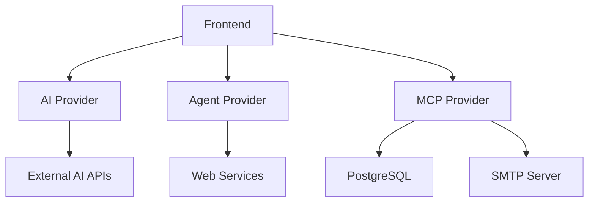
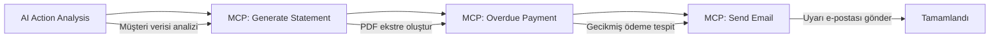
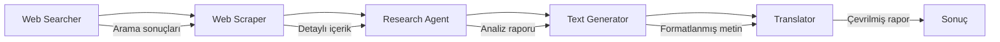
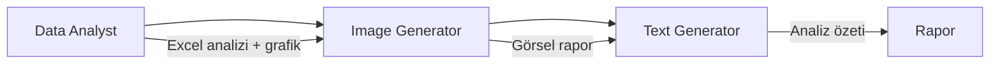
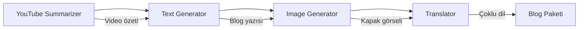
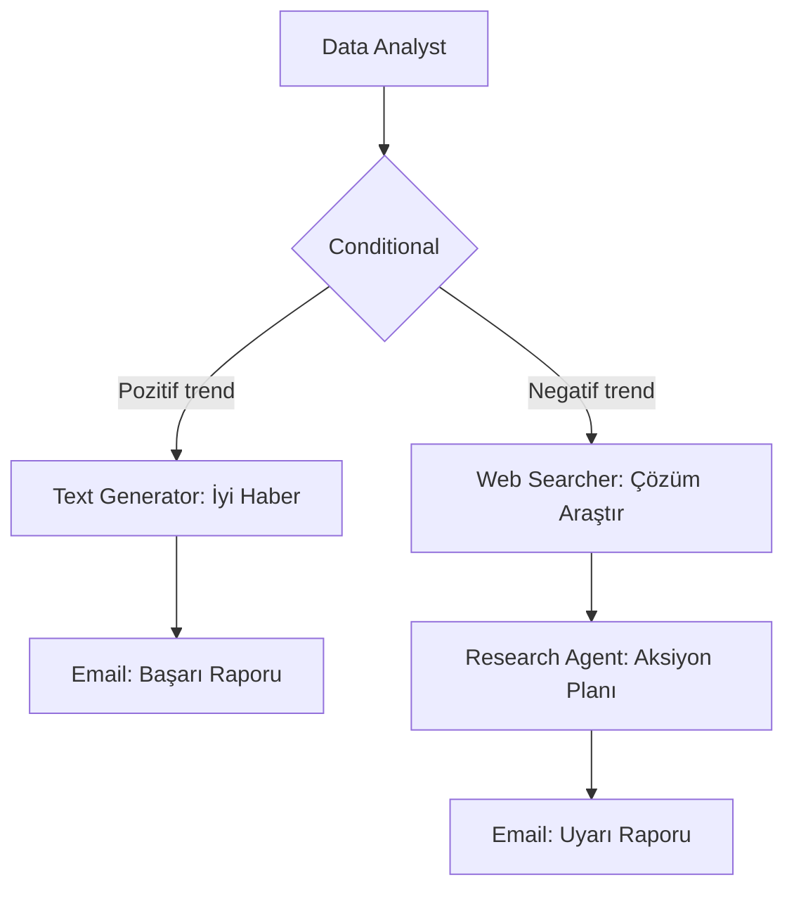
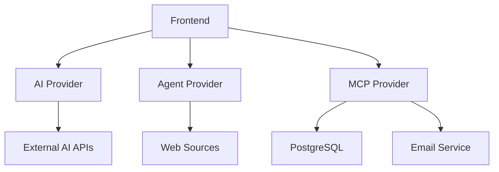

# AI Agent Automation Platform

[](https://opensource.org/licenses/MIT)
[](https://openjdk.java.net/projects/jdk/17/)
[](https://spring.io/projects/spring-boot)
[](https://nextjs.org/)
[](https://www.typescriptlang.org/)
[](https://www.postgresql.org/)
[](https://reactjs.org/)

Modern AI tabanlı iş süreçlerini otomatikleştiren **görsel flow editörü** ve **mikroservis tabanlı agent sistemi**. 

Drag & drop arayüzü ile karmaşık AI iş akışları oluşturun, finansal analiz yapın, otomatik raporlama ve e-posta gönderimi gerçekleştirin.


*AI Agent Flow Editor - Görsel İş Akışı Tasarım Arayüzü*

## 📋 İçindekiler

- [🏗️ Sistem Mimarisi](#️-sistem-mimarisi)
- [🚀 Özellikler](#-özellikler)
- [🏢 Mikroservis Detayları](#-mikroservis-detayları)
- [💡 Örnek Senaryolar](#-örnek-senaryolar)
- [🔄 Flow Execution Mantığı](#-flow-execution-mantığı)
- [🛠️ Kurulum ve Çalıştırma](#️-kurulum-ve-çalıştırma)
- [🎨 Kullanım](#-kullanım)
- [🔧 API Endpoints](#-api-endpoints)
- [🧪 Test](#-test)
- [📈 Monitoring](#-monitoring)

## 🚀 Quick Start

```bash
# 1. Repository'yi klonlayın
git clone https://github.com/[your-username]/ai-agent-automation.git
cd ai-agent-automation

# 2. PostgreSQL veritabanını başlatın
createdb mcp_db

# 3. Backend servisleri başlatın (her biri ayrı terminal'de)
mvn clean install
cd mcp-provider && mvn spring-boot:run &      # Port: 8083
cd ../agent-provider && mvn spring-boot:run & # Port: 8081
cd ../ai-provider && mvn spring-boot:run &    # Port: 8082

# 4. Frontend'i başlatın
cd frontend
npm install && npm run dev                    # Port: 3000

# 5. Tarayıcıda açın: http://localhost:3000
```

## 🏗️ Sistem Mimarisi

Bu proje, **mikroservis mimarisi** ile tasarlanmış kapsamlı bir AI agent automation platformudur:

### 📊 Mikroservis Yapısı

```
AI Agent Automation Platform
├── 🎨 Frontend (Next.js + TypeScript)    → Port: 3000
│   ├── React Flow Editor
│   │   ├── Redux State Management  
│   │   ├── Tailwind CSS + Radix UI
│   │   └── Unified Content Viewer
│   ├── 🤖 AI Provider (Spring Boot)          → Port: 8082
│   │   ├── Multi-Model AI Integration
│   │   ├── HuggingFace, OpenAI, Gemini
│   │   └── Model Response Processing
│   ├── 🔧 Agent Provider (Spring Boot)       → Port: 8081  
│   │   ├── Web Scraping & Data Analysis
│   │   ├── File Processing (Excel, PDF)
│   │   ├── Chart Generation
│   │   └── Code Interpretation
│   └── 💼 MCP Provider (Spring Boot)         → Port: 8083
│       ├── PostgreSQL Database
│       ├── Business Logic & Workflows
│       ├── Email & PDF Generation
│       └── Customer Management
```

### 🔗 Servis İletişimi



## 🚀 Özellikler

### 🎯 İş Agentları (Business Agents)
- **AI Action Analysis**: Finansal işlem analizi ve aksiyon tespiti
- **MCP Supplier Agent**: MCP protokolü ile tedarikçi entegrasyonu
  - **GENERATE_STATEMENT**: Ekstre üretimi ve PDF oluşturma
  - **OVERDUE_PAYMENT**: Gecikmiş ödeme kontrolü ve analizi
  - **SEND_EMAIL**: Otomatik e-posta gönderimi ve ek dosya yönetimi

### 🔧 Genel Agentlar (General Agents)
- **Web Scraper**: Web sitelerinden veri çekme ve içerik analizi
- **Web Searcher**: İnternet araması ve sonuç analizi
- **Code Interpreter**: Python/JavaScript kod çalıştırma
- **Data Analyst**: Excel/CSV analizi ve grafik üretimi
- **Image Generator**: AI ile görsel üretimi (DALL-E, Stable Diffusion)
- **Text Generator**: Metin üretimi ve düzenleme
- **Translator**: Çok dilli çeviri (50+ dil)
- **YouTube Summarizer**: Video transkript analizi ve özetleme
- **Research Agent**: Kapsamlı araştırma ve rapor hazırlama

### 🎛️ Kontrol Yapıları
- **Conditional Node**: Koşullu dallanma ve akış kontrolü
- **Result Node**: Sonuç görüntüleme ve veri export

### 🎨 UI/UX Özellikleri
- **Unified Content Viewer**: Tüm node'lar için JSON/Markdown viewer
- **Real-time Execution**: Canlı akış takibi
- **Drag & Drop Interface**: React Flow ile sezgisel editör
- **Dark/Light Theme**: Tema desteği
- **Responsive Design**: Mobil uyumlu tasarım

## 💡 Örnek Senaryolar

### 📊 Senaryo 1: Finansal Ekstre Analizi ve E-posta Gönderimi

**Kullanım Durumu**: Müşteri ekstresini analiz edip, gecikmiş ödemeler için otomatik uyarı e-postası gönderme



**Adımlar**:
1. **AI Action Analysis**: Müşteri verisini analiz eder, gerekli aksiyonları belirler
2. **Generate Statement**: Müşteri ekstresini PDF olarak oluşturur
3. **Overdue Payment**: Gecikmiş ödemeleri tespit eder ve analiz eder
4. **Send Email**: PDF ekstre ile birlikte uyarı e-postası gönderir

**Örnek Çıktı**:
```json
{
  "customer": "Ahmet Yılmaz",
  "totalAmount": 15750.50,
  "overdueAmount": 3200.00,
  "attachments": ["statement_202412.pdf"],
  "emailSent": true,
  "emailId": "12345"
}
```

### 🔍 Senaryo 2: Web Araştırması ve Rapor Hazırlama

**Kullanım Durumu**: Belirli bir konu hakkında web araştırması yapıp kapsamlı rapor hazırlama



**Adımlar**:
1. **Web Searcher**: Konuyla ilgili web araması yapar
2. **Web Scraper**: Bulunan sitelerin içeriklerini çeker
3. **Research Agent**: Toplanan bilgileri analiz eder ve rapor hazırlar
4. **Text Generator**: Raporu düzenler ve formatlar
5. **Translator**: Raporu istenen dile çevirir

### 📈 Senaryo 3: Veri Analizi ve Görselleştirme

**Kullanım Durumu**: Excel dosyasını analiz edip grafik oluşturma ve özetleme



**Adımlar**:
1. **Data Analyst**: Excel/CSV dosyasını analiz eder, grafik oluşturur
2. **Image Generator**: Ek görseller ve infografikler üretir
3. **Text Generator**: Analiz sonuçlarını özetler

### 🎥 Senaryo 4: YouTube Video Analizi ve İçerik Üretimi

**Kullanım Durumu**: YouTube videosunu analiz edip blog yazısı hazırlama



**Adımlar**:
1. **YouTube Summarizer**: Video transkriptini analiz eder ve özetler
2. **Text Generator**: Özeti blog yazısına dönüştürür
3. **Image Generator**: Blog için kapak görseli oluşturur
4. **Translator**: İçeriği farklı dillere çevirir

### 🔄 Senaryo 5: Koşullu İş Akışı

**Kullanım Durumu**: Veri analizi sonucuna göre farklı aksiyonlar alma



**Adımlar**:
1. **Data Analyst**: Veriyi analiz eder
2. **Conditional**: Sonuca göre dallanır
3. **Pozitif**: Başarı raporu hazırlar ve e-posta gönderir
4. **Negatif**: Çözüm araştırır ve aksiyon planı hazırlar

## 🏢 Mikroservis Detayları

### 🎨 Frontend (Next.js + TypeScript)
**Port**: 3000 | **Framework**: Next.js 15.3.2 | **Language**: TypeScript 5.8.3

```
frontend/
├── src/
│   ├── components/
│   │   ├── flow/
│   │   │   ├── FlowEditor.tsx      # Ana flow editörü
│   │   │   ├── AIAgentNode.tsx     # Agent node bileşeni
│   │   │   ├── ConditionalNode.tsx # Koşullu node
│   │   │   ├── ResultNode.tsx      # Sonuç node
│   │   │   └── ModelConfigForm.tsx # AI model konfigürasyonu
│   │   ├── ui/                     # Shadcn/ui bileşenleri
│   │   │   ├── customer-search.tsx # Müşteri arama
│   │   │   ├── action-type-selector.tsx # Aksiyon seçici
│   │   │   └── loading.tsx         # Loading bileşeni
│   │   └── WorkflowSelector.tsx    # Workflow yönetimi
│   ├── store/
│   │   ├── slices/
│   │   │   ├── flowSlice.ts        # Flow state yönetimi
│   │   │   ├── customerSlice.ts    # Müşteri state yönetimi
│   │   │   └── actionTypesSlice.ts # Aksiyon tipleri
│   │   ├── types.ts                # TypeScript tipleri
│   │   ├── defaultConfigs.ts       # Varsayılan konfigürasyonlar
│   │   └── mcpConstants.ts         # MCP sabitleri
│   ├── api/
│   │   ├── agents.ts               # Agent API çağrıları
│   │   ├── customer.ts             # Müşteri API'leri
│   │   └── workflows.ts            # Workflow API'leri
│   └── config/
│       └── env.ts                  # Environment konfigürasyonu
├── package.json                    # Dependencies
├── tailwind.config.ts              # Styling konfigürasyonu
├── tsconfig.json                   # TypeScript konfigürasyonu
└── next.config.ts                  # Next.js konfigürasyonu
```

**Temel Teknolojiler:**
- **React 19.1.0**: Modern React features
- **React Flow 11.11.4**: Görsel node editörü
- **Redux Toolkit 2.8.2**: State yönetimi
- **Tailwind CSS 3.4.17**: Utility-first CSS
- **Radix UI**: Headless UI bileşenleri
- **React Markdown 9.1.0**: Markdown rendering
- **Axios 1.9.0**: HTTP client
- **Lucide React**: Modern iconlar

**Öne Çıkan Özellikler:**
- **Unified Content Viewer**: Tüm node'lar için JSON/Markdown viewer
- **Real-time State Management**: Redux ile canlı state takibi
- **Drag & Drop Interface**: React Flow ile sezgisel editör
- **Responsive Design**: Tailwind ile mobil uyumlu tasarım
- **Type Safety**: Kapsamlı TypeScript tiplemesi

### 🤖 AI Provider (Spring Boot)
**Port**: 8082 | **Framework**: Spring Boot 3.2.5 | **Language**: Java 17

```
ai-provider/
├── src/main/java/com/example/aiprovider/
│   ├── controller/
│   │   └── AiController.java       # AI API endpoints
│   ├── service/
│   │   ├── AiService.java          # AI service orchestration
│   │   └── ModelService.java       # Model management
│   ├── model/
│   │   ├── AiRequest.java          # Request models
│   │   ├── AiResponse.java         # Response models
│   │   └── ModelConfig.java        # Model configurations
│   ├── client/
│   │   ├── HuggingFaceClient.java  # HuggingFace API client
│   │   ├── OpenAiClient.java       # OpenAI API client
│   │   └── GeminiClient.java       # Google Gemini client
│   ├── config/
│   │   └── AppConfig.java          # Application configuration
│   └── exception/
│       └── AiException.java        # Custom exceptions
├── pom.xml                         # Maven dependencies
└── src/main/resources/
    ├── application.properties      # Main configuration
    └── application-secrets.properties.example # Secret template
```

**Temel Teknolojiler:**
- **Spring Boot Web 3.2.5**: REST API framework
- **Spring Cloud OpenFeign 4.1.0**: Mikroservis iletişimi
- **Jackson**: JSON processing
- **Lombok**: Code generation
- **Spring Boot Validation**: Input validation

**Desteklenen AI Modeller:**
- **HuggingFace**: DeepSeek, Llama, Mistral
- **OpenAI**: GPT-4, GPT-3.5-turbo
- **Google Gemini**: Gemini Pro, Gemini Pro Vision
- **Anthropic**: Claude 3.5 Sonnet
- **Custom Models**: Extensible architecture

**Sorumluluklar:**
- AI model entegrasyonları ve yönetimi
- Multi-model response handling
- Rate limiting ve error handling
- Model performance monitoring

### 🔧 Agent Provider (Spring Boot)
**Port**: 8081 | **Framework**: Spring Boot 3.2.5 | **Language**: Java 17

```
agent-provider/
├── src/main/java/com/example/agentprovider/
│   ├── controller/
│   │   ├── AgentController.java    # Agent endpoints
│   │   ├── WebScraperController.java # Web scraping
│   │   ├── DataAnalystController.java # Data analysis
│   │   └── TranslatorController.java # Translation
│   ├── service/
│   │   ├── WebScrapingService.java # Web scraping logic
│   │   ├── DataAnalysisService.java # Data analysis
│   │   ├── ChartGenerationService.java # Chart creation
│   │   ├── CodeInterpreterService.java # Code execution
│   │   └── TranslationService.java # Translation logic
│   ├── model/
│   │   ├── AgentRequest.java       # Request models
│   │   ├── AgentResponse.java      # Response models
│   │   └── ChartData.java          # Chart data models
│   ├── client/
│   │   ├── YoutubeClient.java      # YouTube API client
│   │   ├── SearchEngineClient.java # Search engine client
│   │   └── AiProviderClient.java   # AI Provider client
│   ├── config/
│   │   ├── WebClientConfig.java    # WebFlux configuration
│   │   └── YoutubeTranscriptorClientConfig.java # YouTube config
│   └── utils/
│       ├── FileUtils.java          # File processing utilities
│       ├── ChartUtils.java         # Chart utilities
│       └── TextUtils.java          # Text processing
├── pom.xml                         # Maven dependencies
└── test-api.sh                     # API testing script
```

**Temel Teknolojiler:**
- **Spring Boot WebFlux 3.2.5**: Reactive programming
- **JSoup 1.17.2**: HTML parsing ve web scraping
- **Apache POI 5.2.5**: Excel/Word processing
- **JFreeChart 1.5.4**: Chart generation
- **Apache Commons Text 1.11.0**: Text utilities
- **Apache Commons CSV 1.10.0**: CSV processing
- **Netty**: Async HTTP client

**Öne Çıkan Özellikler:**
- **Reactive Programming**: WebFlux ile non-blocking operations
- **Multi-format Support**: Excel, CSV, PDF, JSON processing
- **Chart Generation**: Professional charts ve graphs
- **Web Scraping**: Advanced scraping with rate limiting
- **Code Execution**: Sandboxed code interpretation

**Sorumluluklar:**
- Web scraping ve data extraction
- File processing ve data analysis
- Chart generation ve visualization
- Code interpretation ve execution
- Text processing ve translation

### 💼 MCP Provider (Spring Boot)
**Port**: 8083 | **Framework**: Spring Boot 3.2.5 | **Language**: Java 17

```
mcp-provider/
├── src/main/java/com/example/mcpprovider/
│   ├── controller/
│   │   ├── CustomerController.java # Müşteri yönetimi
│   │   ├── ActionController.java   # MCP aksiyonları
│   │   ├── EmailController.java    # E-posta yönetimi
│   │   └── WorkflowController.java # Workflow yönetimi
│   ├── service/
│   │   ├── CustomerService.java    # Müşteri servisi
│   │   ├── ActionAnalysisService.java # Aksiyon analizi
│   │   ├── StatementService.java   # Ekstre servisi
│   │   ├── EmailService.java       # E-posta servisi
│   │   ├── PaymentService.java     # Ödeme servisi
│   │   └── WorkflowService.java    # Workflow servisi
│   ├── entity/
│   │   ├── Customer.java           # Müşteri entity
│   │   ├── Transaction.java        # İşlem entity
│   │   ├── EmailAttachment.java    # E-posta eki entity
│   │   └── Workflow.java           # Workflow entity
│   ├── repository/
│   │   ├── CustomerRepository.java # Müşteri repository
│   │   ├── TransactionRepository.java # İşlem repository
│   │   ├── EmailAttachmentRepository.java # Ek repository
│   │   └── WorkflowRepository.java # Workflow repository
│   ├── dto/
│   │   ├── CustomerDto.java        # Müşteri DTO
│   │   ├── ActionAnalysisRequest.java # Analiz request
│   │   ├── EmailResponseDto.java   # E-posta response
│   │   └── WorkflowDto.java        # Workflow DTO
│   ├── mapper/
│   │   ├── CustomerMapper.java     # Müşteri mapper
│   │   └── WorkflowMapper.java     # Workflow mapper
│   ├── config/
│   │   ├── DatabaseConfig.java     # Database configuration
│   │   ├── EmailConfig.java        # E-posta configuration
│   │   └── AiProviderConfig.java   # AI Provider client
│   ├── client/
│   │   └── AiProviderClient.java   # AI Provider client
│   └── enums/
│       ├── PaymentStatus.java      # Ödeme durumu enum
│       └── TransactionType.java    # İşlem tipi enum
├── pom.xml                         # Maven dependencies
└── src/main/resources/
    ├── application.properties      # Ana konfigürasyon
    ├── application-secrets.properties.example # Secret template
    ├── db/migration/               # Flyway migrations
    │   ├── V1__initial_schema.sql  # İlk schema
    │   ├── V2__add_transactions.sql # İşlemler tablosu
    │   └── V3__add_workflows.sql   # Workflow tablosu
    └── templates/
        ├── email-template.html     # E-posta template
        └── statement-template.html # Ekstre template
```

**Temel Teknolojiler:**
- **Spring Boot Data JPA 3.2.5**: ORM ve database operations
- **PostgreSQL 16**: Primary database
- **Spring Boot Mail**: E-posta gönderimi
- **Thymeleaf**: Template engine
- **iText7 7.2.5**: PDF generation
- **Flyway 9.22.3**: Database migration
- **Jackson**: JSON processing
- **Lombok**: Code generation

**Database Schema:**
```sql
-- Ana tablolar
customers (id, first_name, last_name, email, phone, created_at)
transactions (id, customer_id, amount, description, transaction_date, type)
email_attachments (id, filename, content_type, file_size, base64_content)
workflows (id, name, description, flow_data, created_at)

-- İlişkiler
transactions.customer_id -> customers.id
workflow_executions.workflow_id -> workflows.id
```

**Öne Çıkan Özellikler:**
- **JPA/Hibernate**: Advanced ORM features
- **Database Migrations**: Flyway ile version control
- **Email Templates**: Thymeleaf ile dynamic templates
- **PDF Generation**: iText ile professional PDFs
- **Transaction Management**: ACID compliance
- **Audit Trail**: Entity lifecycle tracking

**Sorumluluklar:**
- Customer relationship management
- Financial transaction processing
- Statement generation ve PDF creation
- Email automation ve template management
- Workflow persistence ve execution tracking
- Business logic implementation

## 🔄 Flow Execution Mantığı

### 1. Topological Sorting
Node'lar dependency sırasına göre otomatik sıralanır:
```
AI Action Analysis → GENERATE_STATEMENT → OVERDUE_PAYMENT → SEND_EMAIL
```

### 2. Sequential Execution
Her node sırasıyla çalıştırılır ve bir sonrakine geçmeden tamamlanması beklenir.

### 3. Data Flow
- Önceki node'ların çıktıları sonraki node'lara input olarak geçer
- Accumulated responses Redux store'da tutulur
- SEND_EMAIL node tüm önceki attachmentIds'leri birleştirir

### 4. Mikroservis İletişimi


## 🛠️ Kurulum ve Çalıştırma

### Gereksinimler
- **Java 17+**
- **Node.js 18+**
- **Maven 3.8+**
- **PostgreSQL 13+**
- **npm veya yarn**

### 1. Backend Mikroservisleri

#### Parent Project Build
```bash
# Tüm mikroservisleri build et
mvn clean install
```

#### AI Provider (Port: 8082)
```bash
cd ai-provider
mvn spring-boot:run
```

#### Agent Provider (Port: 8081)
```bash
cd agent-provider
mvn spring-boot:run
```

#### MCP Provider (Port: 8083)
```bash
cd mcp-provider

# PostgreSQL veritabanı oluştur
createdb mcp_db

# Veritabanı migrasyonları
mvn flyway:migrate

# Servisi başlat
mvn spring-boot:run
```

### 2. Frontend Kurulumu
```bash
cd frontend
npm install
npm run dev
```

### Environment Variables

#### Backend (.env veya application.properties)
```properties
# Database
spring.datasource.url=jdbc:postgresql://localhost:5432/mcp_db
spring.datasource.username=postgres
spring.datasource.password=postgres

# Email
spring.mail.host=smtp.gmail.com
spring.mail.username=your-email@gmail.com
spring.mail.password=your-app-password

# External APIs
RAPIDAPI_YOUTUBE_TRANSCRIPTOR_KEY=your_rapidapi_key
DEEPL_API_AUTH_KEY=your_deepl_api_key
```

#### Frontend (.env.local)
```env
NEXT_PUBLIC_API_URL=http://localhost:8083/mcp-provider
NEXT_PUBLIC_AI_PROVIDER_URL=http://localhost:8082
NEXT_PUBLIC_AGENT_PROVIDER_URL=http://localhost:8081
```

## 🎨 Kullanım

### 1. Node Ekleme
- Sol panelden istenen agent tipini sürükle-bırak
- **İş Agentları**: Müşteri odaklı operasyonlar
- **Genel Agentlar**: Genel amaçlı işlemler

### 2. Node Konfigürasyonu
- Her node'a tıklayarak ayarları düzenleyin
- Model konfigürasyonu (GPT, Claude, Hugging Face)
- Özel parametreler ve system prompt'lar

### 3. Bağlantı Kurma
- Node'lar arası veri akışını tanımlayın
- Conditional node'lar için true/false çıkışları

### 4. Execution
- **"Çalıştır"** butonu ile flow'u başlatın
- Real-time execution durumunu takip edin
- Edge'ler renk kodlu durum gösterir:
  - 🔴 **Kırmızı**: Hata
  - 🟡 **Turuncu**: Çalışıyor
  - 🟢 **Yeşil**: Tamamlandı
  - ⚪ **Gri**: Bekliyor

## 🔧 API Endpoints

### MCP Provider (Port: 8083)

#### Customer Management
```http
POST /mcp-provider/api/customers/search
Content-Type: application/json

{
  "query": "Ahmet",
  "limit": 10
}
```

#### MCP Actions
```http
POST /mcp-provider/api/mcp-request
Content-Type: application/json

{
  "actionType": "GENERATE_STATEMENT",
  "customerId": "123",
  "parameters": {
    "startDate": "2024-01-01",
    "endDate": "2024-12-31"
  }
}
```

#### Workflow Management
```http
POST /mcp-provider/api/workflows
GET /mcp-provider/api/workflows
PUT /mcp-provider/api/workflows/{id}
DELETE /mcp-provider/api/workflows/{id}
```

### AI Provider (Port: 8082)

#### AI Model Execution
```http
POST /ai-provider/api/ai/process
Content-Type: application/json

{
  "prompt": "Analyze this financial data...",
  "model": "gpt-4",
  "systemPrompt": "You are a financial analyst...",
  "temperature": 0.7,
  "maxTokens": 1000
}
```

#### Model Configuration
```http
GET /ai-provider/api/models
POST /ai-provider/api/models/configure
```

### Agent Provider (Port: 8081)

#### Web Scraping
```http
POST /agent-provider/api/web-scraper
Content-Type: application/json

{
  "url": "https://example.com",
  "selector": ".content",
  "waitTime": 2000
}
```

#### Data Analysis
```http
POST /agent-provider/api/data-analyst
Content-Type: multipart/form-data

file: [Excel/CSV file]
analysisType: "SUMMARY"
```

#### Translation
```http
POST /agent-provider/api/translator
Content-Type: application/json

{
  "text": "Hello world",
  "sourceLang": "en",
  "targetLang": "tr"
}
```

## 🧪 Test

### Backend Tests
```bash
# Tüm testleri çalıştır
mvn test

# Belirli bir servis için test
cd mcp-provider
mvn test

# Test coverage raporu
mvn jacoco:report
```

### API Testing
```bash
# Agent Provider test script
cd agent-provider
./test-api.sh

# Manual API testing
curl -X POST http://localhost:8083/mcp-provider/api/customers/search \
  -H "Content-Type: application/json" \
  -d '{"query": "test", "limit": 5}'
```

### Frontend Tests
```bash
cd frontend
npm test
npm run test:coverage
```

## 📈 Monitoring

### Health Checks
```http
GET /actuator/health          # MCP Provider
GET /agent-provider/actuator/health    # Agent Provider
GET /ai-provider/actuator/health       # AI Provider
```

### Metrics
```http
GET /actuator/metrics         # Application metrics
GET /actuator/prometheus      # Prometheus format
```

### Logs
```bash
# Application logs
tail -f logs/application.log

# Database query logs
tail -f logs/hibernate.log

# Email service logs
tail -f logs/email.log
```

## 🚀 Deployment

### Docker Deployment
```bash
# Build images
docker build -t ai-provider ./ai-provider
docker build -t agent-provider ./agent-provider
docker build -t mcp-provider ./mcp-provider
docker build -t frontend ./frontend

# Run with Docker Compose
docker-compose up -d
```

### Production Configuration
```yaml
# docker-compose.prod.yml
version: '3.8'
services:
  postgres:
    image: postgres:16
    environment:
      POSTGRES_DB: mcp_db
      POSTGRES_USER: postgres
      POSTGRES_PASSWORD: ${DB_PASSWORD}
    volumes:
      - postgres_data:/var/lib/postgresql/data
    
  mcp-provider:
    image: mcp-provider:latest
    ports:
      - "8083:8083"
    environment:
      SPRING_PROFILES_ACTIVE: prod
      SPRING_DATASOURCE_URL: jdbc:postgresql://postgres:5432/mcp_db
    depends_on:
      - postgres
      
  agent-provider:
    image: agent-provider:latest
    ports:
      - "8081:8081"
      
  ai-provider:
    image: ai-provider:latest
    ports:
      - "8082:8082"
      
  frontend:
    image: frontend:latest
    ports:
      - "3000:3000"
    environment:
      NEXT_PUBLIC_API_URL: http://mcp-provider:8083/mcp-provider
      
volumes:
  postgres_data:
```

## 🔒 Security

### Authentication & Authorization
- JWT token based authentication (planned)
- Role-based access control (RBAC)
- API rate limiting

### Data Protection
- Sensitive data encryption
- Secure password handling
- HTTPS enforcement in production

### Environment Security
```bash
# Encrypt sensitive properties
jasypt-maven-plugin:encrypt-value -Djasypt.encryptor.password=mySecretKey
```

## 📚 Documentation

### API Documentation
- Swagger UI: `http://localhost:8083/swagger-ui.html`
- OpenAPI 3.0 specification
- Postman collection available

### Code Documentation
```bash
# Generate JavaDoc
mvn javadoc:javadoc

# Generate TypeScript docs
cd frontend && npm run docs
```

## 🤝 Contributing

### Development Workflow
1. Fork the repository
2. Create feature branch: `git checkout -b feature/amazing-feature`
3. Commit changes: `git commit -m 'Add amazing feature'`
4. Push to branch: `git push origin feature/amazing-feature`
5. Open Pull Request

### Code Standards
- **Java**: Google Java Style Guide
- **TypeScript**: ESLint + Prettier configuration
- **Git**: Conventional Commits

### Testing Requirements
- Unit tests for all business logic
- Integration tests for API endpoints
- E2E tests for critical user flows

## 📄 License

This project is licensed under the MIT License - see the [LICENSE](LICENSE) file for details.

## 🙏 Acknowledgments

- [React Flow](https://reactflow.dev/) - Flow editor library
- [Spring Boot](https://spring.io/projects/spring-boot) - Backend framework
- [Next.js](https://nextjs.org/) - Frontend framework
- [PostgreSQL](https://www.postgresql.org/) - Database
- [Tailwind CSS](https://tailwindcss.com/) - Styling framework

## 📞 Support

- **Issues**: [GitHub Issues](https://github.com/[your-username]/ai-agent-automation/issues)
- **Discussions**: [GitHub Discussions](https://github.com/[your-username]/ai-agent-automation/discussions)
- **Email**: support@ai-agent-automation.com

---

**⭐ Bu projeyi beğendiyseniz yıldız vermeyi unutmayın!** 