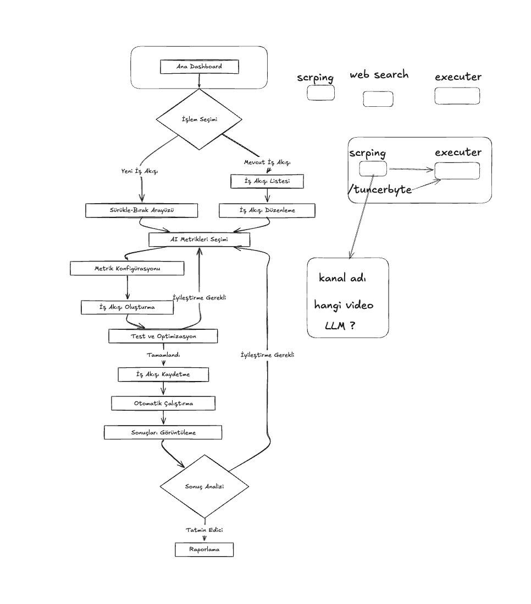

# AI Agent Otomasyon Frontend

Bu proje, AI Agent Otomasyon sisteminin frontend kısmını içerir. React ve Next.js kullanılarak geliştirilmiş modern bir web uygulamasıdır.

## Sistem Tasarımı



## 🛠️ Teknolojiler

- **Framework**: Next.js 14 (App Router)
- **Dil**: TypeScript
- **State Yönetimi**: Redux Toolkit
- **UI Kütüphanesi**: shadcn/ui
- **Akış Diyagramı**: React Flow
- **Stil**: Tailwind CSS
- **Bildirimler**: Sonner
- **Icons**: Radix Icons

## 📦 Kurulum

1. Gereksinimleri yükleyin:
   ```bash
   node >= 18.0.0
   npm >= 9.0.0
   ```

2. Bağımlılıkları yükleyin:
   ```bash
   npm install
   ```

3. Geliştirme sunucusunu başlatın:
   ```bash
   npm run dev
   ```

4. Tarayıcınızda açın:
   ```
   http://localhost:3000
   ```

## 🏗️ Proje Yapısı

```
frontend/
├── src/
│   ├── app/                 # Next.js app router
│   │   ├── components/          # Yeniden kullanılabilir bileşenler
│   │   │   ├── ui/             # Temel UI bileşenleri
│   │   │   └── flow/           # Flow diyagramı bileşenleri
│   │   ├── store/              # Redux store ve slice'lar
│   │   │   ├── slices/         # Redux slice'ları
│   │   │   └── types.ts        # TypeScript tipleri
│   │   └── styles/             # Global stiller
│   ├── public/                 # Statik dosyalar
│   └── package.json           # Proje bağımlılıkları
```

## 🤖 Desteklenen AI Agentlar

- 🕷️ Web Scraper: Web sayfalarından veri çıkarma
- 🔍 Web Searcher: İnternet üzerinde arama yapma
- 💻 Code Interpreter: Kod çalıştırma ve programlama
- 📊 Data Analyst: Veri analizi ve görselleştirme
- 🎨 Image Generator: AI destekli görsel oluşturma
- 📝 Text Generator: İçerik ve metin üretimi
- 🌐 Translator: Çoklu dil çeviri asistanı
- 📺 YouTube Summarizer: Video içerik özetleme
- 📋 Result Viewer: Agent çıktılarını görüntüleme

## 🔧 Konfigürasyon

Her agent tipi için özelleştirilebilir ayarlar:

- Model seçimi (GPT-4, Gemini Pro, Claude, vb.)
- Çıktı formatı
- Dil tercihleri
- Özel promptlar
- Görsel ayarlar
- Bağlantı kuralları

## 🌊 Flow Editör Özellikleri

- Node ekleme/silme/düzenleme
- Bağlantı oluşturma/silme
- Otomatik düzen
- Yakınlaştırma/uzaklaştırma
- Mini harita
- Arka plan ızgarası
- Durum geçmişi

## 🔄 Redux Store Yapısı

```typescript
interface RootState {
  flow: {
    nodes: AgentNode[];
    edges: FlowConnection[];
    selectedNodeId: string | null;
    isRunning: boolean;
    executionResults: Record<string, ExecutionResult>;
  };
  settings: {
    theme: 'light' | 'dark';
    language: 'tr' | 'en';
    autoSave: boolean;
    // ...diğer ayarlar
  };
  history: {
    entries: HistoryEntry[];
    // ...geçmiş kayıtları
  };
}
```

## 🎯 Kullanım

1. Sol menüden bir agent seçin
2. Çalışma alanına sürükleyin
3. Agent'ı yapılandırın
4. Diğer agentlarla bağlantılar kurun
5. Akışı çalıştırın ve sonuçları görüntüleyin

## 🤝 Katkıda Bulunma

1. Bu depoyu fork edin
2. Yeni bir branch oluşturun (`git checkout -b feature/amazing-feature`)
3. Değişikliklerinizi commit edin (`git commit -m 'feat: add amazing feature'`)
4. Branch'inizi push edin (`git push origin feature/amazing-feature`)
5. Bir Pull Request oluşturun

## 📝 Lisans

Bu proje MIT lisansı altında lisanslanmıştır. Detaylar için [LICENSE](LICENSE) dosyasına bakın.

## 📞 İletişim

- Proje Sahibi: Tuncer Bağçabaşı
- E-posta: tuncerbbostancibasi@gmail.com
- GitHub: https://github.com/atesbey-design

## 🙏 Teşekkürler

Bu projeyi mümkün kılan tüm açık kaynak kütüphanelere ve topluluğa teşekkürler:

- Next.js
- React Flow
- shadcn/ui
- Redux Toolkit
- Tailwind CSS
- ve diğerleri...
